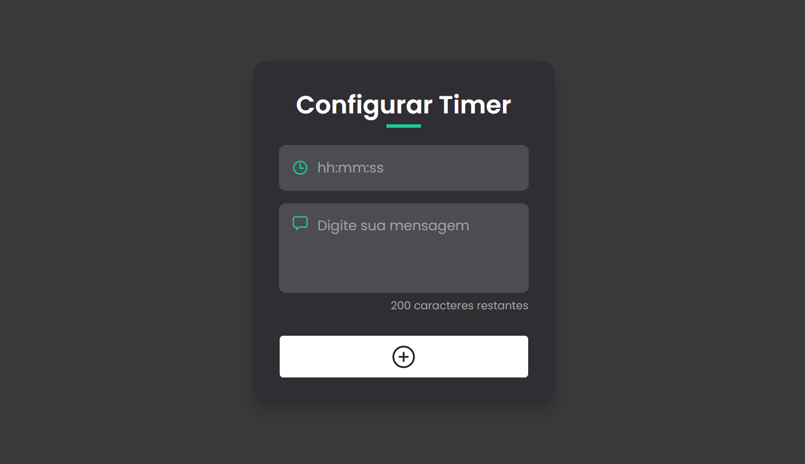
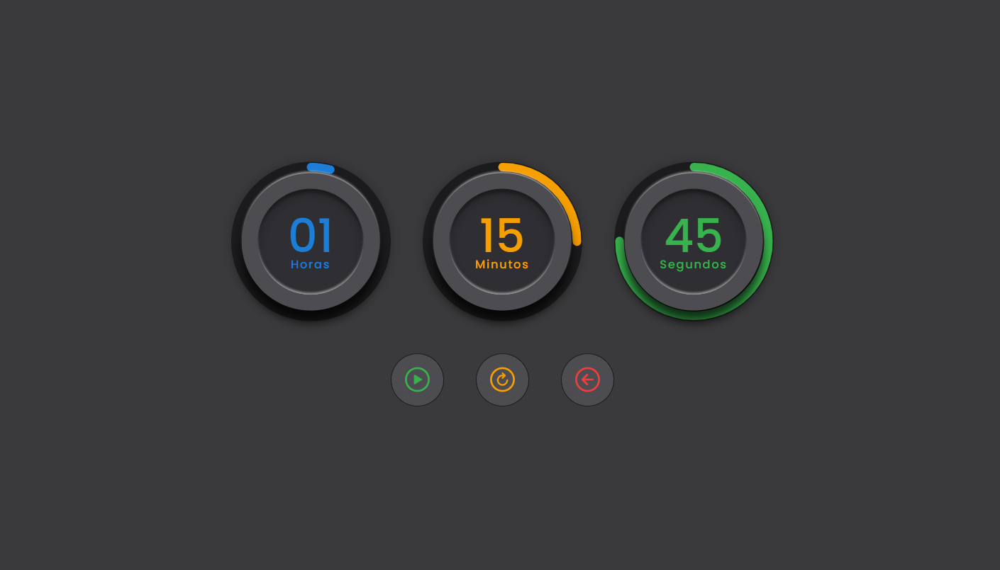

# ⏰ Countdown Timer

Um timer de contagem regressiva moderno e interativo desenvolvido em HTML, CSS e JavaScript puro. Permite configurar tempos personalizados e exibir mensagens customizadas quando o timer finalizar.


<div style="display: flex; justify-content: space-between; flex-wrap: wrap;">
  
  
</div>

## 🚀 Funcionalidades

### ✨ Principais Recursos
- **Interface moderna e responsiva** com design circular animado
- **Configuração flexível de tempo** (formato hh:mm:ss ou hh:mm)
- **Mensagens personalizadas** (até 200 caracteres)
- **Validações robustas** com SweetAlert2
- **Controles intuitivos**: Iniciar, Pausar, Resetar
- **Animações suaves** nos círculos SVG
- **Feedback visual** em tempo real

### 🎯 Validações Implementadas
- ✅ Campos obrigatórios (tempo e mensagem)
- ✅ Formato de tempo válido
- ✅ Valores de minutos e segundos (0-59)
- ✅ Tempo maior que zero
- ✅ Limite máximo de 24 horas
- ✅ Confirmações para ações importantes

### 🎨 Experiência do Usuário
- **Alertas elegantes** com SweetAlert2
- **Confirmações** para reset e voltar às configurações
- **Opção de novo timer** ao finalizar
- **Feedback visual** para todas as ações
- **Interface intuitiva** e fácil de usar

## 🛠️ Tecnologias Utilizadas

- **HTML5** - Estrutura semântica
- **CSS3** - Estilos e animações
- **JavaScript (ES6+)** - Lógica e interatividade
- **SweetAlert2** - Alertas e validações
- **Ionicons** - Ícones modernos
- **SVG** - Animações circulares

## 🎨 Design e Créditos

### Design do Timer Circular
O design visual dos círculos do timer foi inspirado no tutorial do YouTube:
- **Vídeo**: [Countdown Timer with Circular Progress Bar](https://www.youtube.com/watch?v=9YAnhgyq4Ao)
- **Crédito**: Apenas o CSS dos círculos SVG foi utilizado como referência

### Desenvolvimento Original
Todo o restante do projeto foi desenvolvido do zero:
- ✅ Lógica JavaScript completa
- ✅ Sistema de validações
- ✅ Interface de formulário
- ✅ Sistema de mensagens personalizadas
- ✅ Integração com SweetAlert2
- ✅ Experiência do usuário aprimorada

## 🚀 Como Usar

### 1. Configuração Inicial
1. Abra o arquivo `index.html` em seu navegador
2. Preencha o campo de tempo no formato `hh:mm:ss` ou `hh:mm`
3. Digite sua mensagem personalizada (máximo 200 caracteres)
4. Clique no botão de configuração

### 2. Controles do Timer
- **▶️ Iniciar**: Começa a contagem regressiva
- **⏸️ Pausar**: Pausa o timer temporariamente
- **🔄 Resetar**: Volta ao tempo inicial configurado
- **⚙️ Configurações**: Volta ao formulário de configuração

### 3. Finalização
- Quando o timer chegar a zero, uma mensagem de sucesso será exibida
- Você pode escolher entre:
  - **OK**: Ver sua mensagem final
  - **Novo Timer**: Configurar um novo timer imediatamente

## 📋 Requisitos

- Navegador moderno com suporte a:
  - ES6+ JavaScript
  - CSS Grid e Flexbox
  - SVG animations
  - Fetch API (para SweetAlert2)

## 🎯 Exemplos de Uso

### Timer de 5 minutos
```
Tempo: 00:05:00
Mensagem: "Hora de fazer uma pausa!"
```

### Timer de 1 hora
```
Tempo: 01:00:00
Mensagem: "Sessão de trabalho concluída!"
```

### Timer de 30 segundos
```
Tempo: 00:00:30
Mensagem: "Tempo esgotado!"
```

## 🔮 Funcionalidades Futuras

- [ ] Sons de notificação
- [ ] Múltiplos timers simultâneos
- [ ] Temas personalizáveis
- [ ] Histórico de timers
- [ ] Modo escuro/claro
- [ ] Notificações do navegador

## 📝 Licença

Este projeto está licenciado sob a Licença MIT - veja o arquivo [LICENSE](LICENSE) para detalhes.

## 👨‍💻 Autor

**Bruno Guimarães**
- GitHub: [@bruno-bg](https://github.com/bruno-bg)
- LinkedIn: [Bruno Guimarães](https://www.linkedin.com/in/bruno-guimar%C3%A3es-421b724a/)

## 🙏 Agradecimentos

- [Ionicons](https://ionic.io/ionicons) pelos ícones
- [SweetAlert2](https://sweetalert2.github.io/) pelos alertas elegantes
- [YouTube Tutorial](https://www.youtube.com/watch?v=9YAnhgyq4Ao) pela inspiração do design circular

---

⭐ Se este projeto foi útil para você, considere dar uma estrela no repositório!
